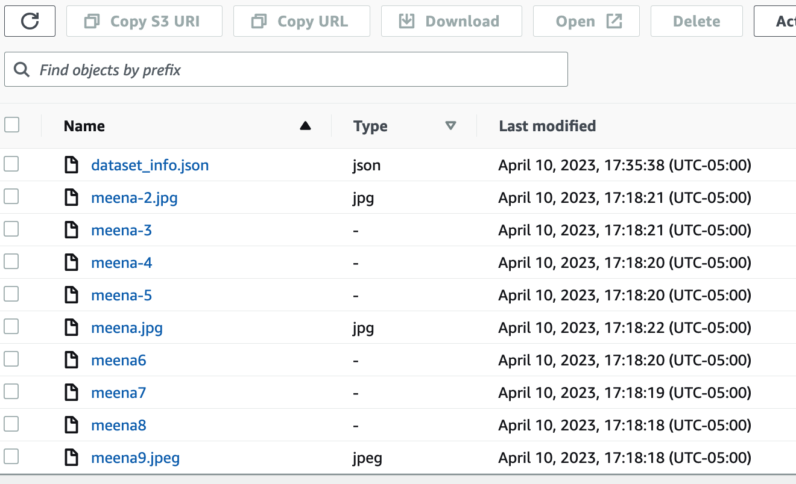
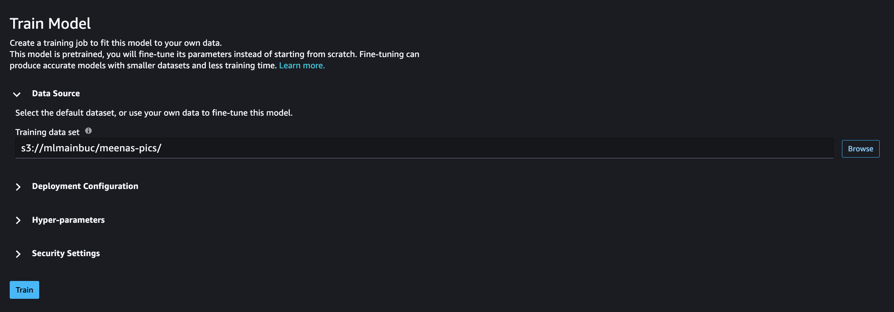
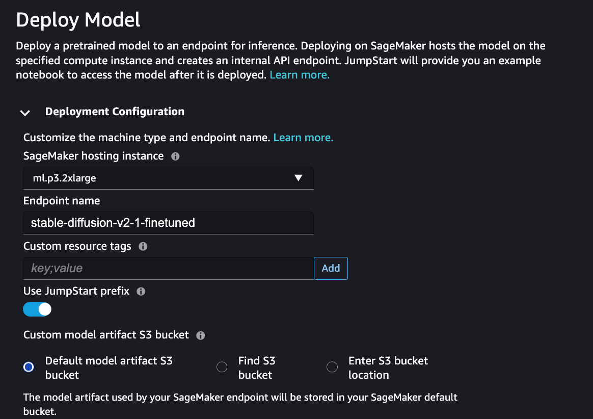

# Make your own avatar using SageMaker Foundation Model Hub

## Pre-requisites

1. AWS Account
2. Acess to Foundation Model hub within the AWS Account - If you do not have access request access as per the guidelines provided in <https://wiki.amazon.com/bin/view/SageMaker-JumpStart/FoundationModels>
3. Use us-east-1 for your lab

## Run the cloud formation template

1. Open up a terminal in your machine and clone the repo
```git clone https://github.com/thandavm/create_your_own_avatar.git```
2. Log in to your AWS Console -> VPC and create a VPC and two subnets. Use default settings. We will not be using them for this
   workshop, but SageMaker Studio which you will create and use in the steps below requires it.
4. Log in to your AWS Console -> CloudFormation
5. Use the [`template.yml`](./template.yml) to create a CloudFormation stack.  Pick the VPC and Subnets you created as parameters

## Create the data set

1. Create a json file simialar to the below and name it dataset_info.json

2. Upload the images and the json file on to an Amazon S3 bucket of your choice in US-EAST-1 (or the same region where you will use SageMaker)


## Fine tune Stable Diffusion Model

1. Log in to your SageMaker Studio [created as a part of the cloud formation template]
2. Click on SageMaker Jumpstarts -> Models, Notebooks and solutions
3. Search for Stable Diffusion and select "Stable Diffusion 2.1 base"

4. Click on the "Train" tab
5. For the training dataset, select the Amazon S3 prefix where you uploaded your data


6. Click on "Train".
Select any available instance for training, ml.g4dn.8xlarge for example 
This will start the fine tuning of the Stable diffusion model and will take ~10 - 12 mins to fine tune

## Deploy the fine tuned Model

1. Once fine tuning is complete, click on the "Deploy" tab
2. Enter a name for the fine tuned model (and make a note of it).
   keep the rest as default. ml.p3.2xlarge is a good instance to choose for deployment

4. Click on "Deploy".  this will take ~7 -8 minutes to complete
5. Copy the end point name,  This is required to be used in the next step

## Play with the model and create your own avatars

1. Back in your local laptop go the folder where you cloned the repo
2. Ensure that python and pip are both installed. 
3. Change directory cd create_your_own_avatar and check for the requirements.txt file as well as the app.py file.
4. It is recommended to use Python Virtual Environment to minimize chances of conflicts with existing python dependencies, it is best to do so in a virtual environment:
```$python3 -m venv .venv```
```$source .venv/bin/activate```
6. Install the required sdk
```pip install -r requirements.txt```
7. Amend the app.py file so that it points to your endpoint (variable ```endpoint_name```) and that it loads your AWS credentials correctly (i.e. set ```credentials_profile_name```)
8. run the app
```streamlit run app.py```
9. Unleash your imagination in the text area.  Few sample below
 "meena man as 10 year old boy"
